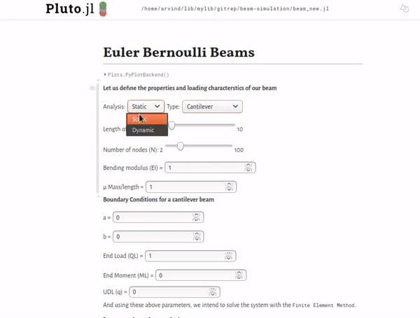
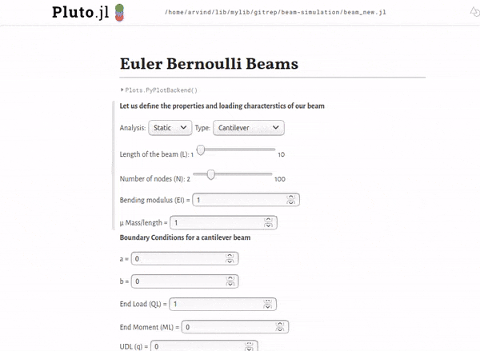

# beam-simulation

Simulating a Bernoulli beam using the finite element method, and some new fun programming tools, the Pluto editor for Julia.

This is a numerical analysis project at TU Berlin with Prof. Michael Karow during summer semester 2020.

### Static Analysis

### Dynamic Analysis

## How to run
Before starting the notebook, make sure of these external dependencies:
- PlutoUI
- SparseArrays
- LinearAlgebra
- Arpack
- ForwardDiff
- PyPlot

To start, run the file `start_notebooks.jl` with Julia.

Link to Pluto repository: https://github.com/fonsp/Pluto.jl